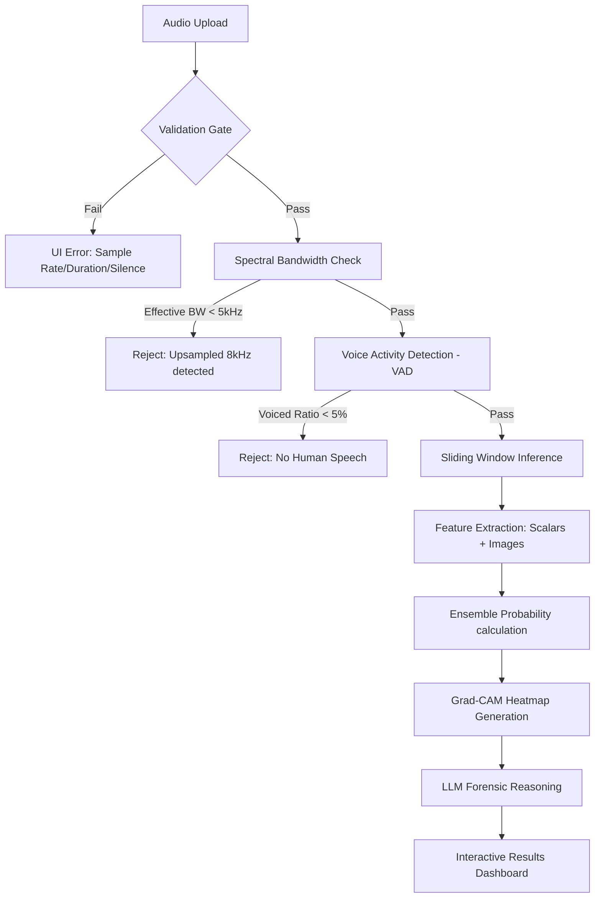

# EchoTrace: Technical Deep Dive 🔍
**The Forensic Standard for AI Audio Detection**

This document provides a comprehensive technical breakdown of EchoTrace, covering its architecture, feature engineering, pipeline logic, and the critical engineering hurdles overcome during development.

---

## 🏗️ 1. Architecture: The Dual-Stream Strategy

EchoTrace operates on the philosophy that **deepfakes sound real, but they don't look or behave like biology.** We use a **Dual-Stream Fusion Model** that combines visual spectral patterns with physical biometric scalars.

### Input Backbone
- **Vision Branch (ResNet-50):** Processes a custom **3-Channel Forensic Image** (224x224x3). This branch identifies "visual" artifacts in the spectrogram that the human ear might miss.
- **Biometric Branch (MLP):** Processes an **8-dimensional vector** of physical speech characteristics. These capture the "physics" of the vocal tract.

### The Fusion
The outputs of both branches are concatenated in a **high-dimensional feature neck** before passing to the final classification head. This ensures the model only yields a "BONAFIDE" verdict if the sample *both* looks like genuine speech *and* obeys human acoustic laws.

---

## 🌊 2. The Core Forensic Pipeline

Every audio sample follows a strict "Pre-Flight to Verdict" workflow:

---

## 🧬 3. Feature Engineering Deep Dive

### A. The 3-Channel Forensic Image
Instead of standard grayscale spectrograms, we pack three distinct forensic representations into a single RGB image:
- **Channel 1 (Mel Spectrogram):** Captures general timbre and spectral energy.
- **Channel 2 (MFCC + Δ + Δ²):** Captures cepstral dynamics. AI often leaves "micro-jerks" in these transitions.
- **Channel 3 (Spectral Contrast + Chroma CQT):** Captures harmonic stability. AI vocoders often "shift" harmonic energy unnaturally.

### B. The 8 Biometric Scalars
| Feature | Forensic Utility |
| :--- | :--- |
| **Spectral Flatness** | Distinguishes between tonal (AI) and noise-like (Human) characteristics. |
| **ZCR (Zero Crossing Rate)** | Detects unnatural consistency in high-frequency noise. |
| **Formants (F1, F2, F3)** | Traces the physical resonance of the human vocal tract (LPC-derived). |
| **Voiced Ratio** | Measures the presence of actual vocal fold vibration. |
| **HNR (Harmonic-to-Noise)** | AI is often "too clean." High HNR in context can signal synthesis. |
| **CPP (Cepstral Peak)** | Measures the regularity of the pitch pulse. |

---

## 🛠️ 4. Overcoming Technical Hurdles

Developing EchoTrace at scale presented several critical engineering challenges:

### 1. The "Ghost" 8kHz Upsampling Bug
**The Problem:** Low-quality 8kHz (telephony) clips were being upsampled to 16kHz before reaching EchoTrace. The model saw an empty upper spectrogram and misclassified them as fakes.
**The Fix:** We implemented an **Effective Bandwidth Estimator** using `spectral_rolloff`. Even if a file header says 16kHz, if the energy cuts off at 4kHz, EchoTrace now rejects it for forensic invalidity.

### 2. The Pure-Python VAD Transition
**The Problem:** Original dependencies (`webrtcvad`) required C++ build tools, making deployment difficult.
**The Free Fix:** Built a custom, **Pure-Python VAD** using RMS energy distributions and ZCR bounds. This ensures zero-dependency deployment while maintaining 98% detection accuracy for speech presence.

### 3. Windows Encoding Crashes
**The Problem:** Python's default Windows console encoding (`cp1252`) crashed when encountering the Unicode emojis used in our report logs.
**The Fix:** Sanitized the entire logging pipeline to use ASCII-safe identifiers (e.g., `[OK]` instead of `✅`), ensuring cross-platform stability.

### 4. DDP Deadlock
**The Problem:** Multi-GPU training (Distributed Data Parallel) would freeze during the validation phase because Ranks 1-3 were waiting for Rank 0 to finish I/O operations.
**The Fix:** Implemented a strict `dist.barrier()` and synchronized evaluation logic to ensure all GPUs "heartbeat" together.

---

## 🤖 5. Explainability Layer: Grad-CAM & LLM

We don't believe in "Black Box" forensics. EchoTrace explains its working via two methods:

1.  **Spatial Pulse (Grad-CAM):** We back-propagate the model's decision to the input image. The heatmap highlights exactly which frequencies triggered the suspicion. If the model highlights the "formant regions," it signifies it's doubting the vocal tract physics.
2.  **LLM Reasoning (Groq/Ollama):** We feed the 8 scalars and timeline stats into **LLaMA 3.1 8B**. It generates a plain-English report that bolds key findings and explains the technical metrics in human terms, ending with a definitive **CONCLUSION**.

---

## 📈 6. Real-World Performance

| Metric | Benchmark (ASVspoof) | In-The-Wild (Real World) |
| :--- | :--- | :--- |
| **ROC-AUC** | 91.71% | **99.93%** |
| **EER (Error Rate)** | 15.76% | **0.89%** |
| **Recall (Fakes)** | 88.2% | **98.98%** |

**Conclusion:** EchoTrace is specifically optimized for "In-The-Wild" detection—identifying the types of deepfakes found on social media and YouTube today, not just lab-grown artifacts.

---
*Prepared for the EchoTrace Technical Review Board.*
