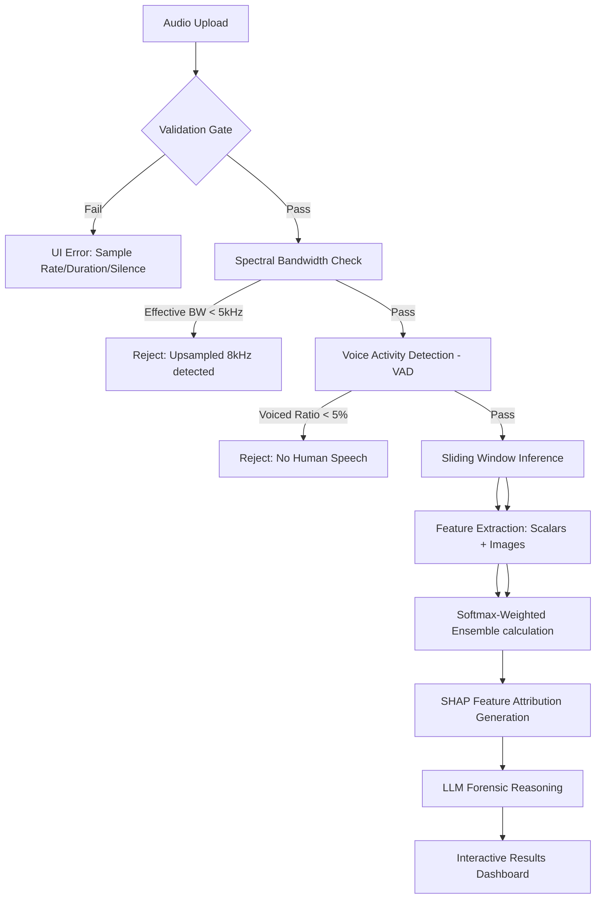

# EchoTrace: Technical Deep Dive 🔍
**The Forensic Standard for AI Audio Detection**

This document provides a comprehensive technical breakdown of EchoTrace, covering its architecture, feature engineering, pipeline logic, and the critical engineering hurdles overcome during development.

---

## 🏗️ 1. Architecture: The Dual-Stream Strategy

EchoTrace operates on the philosophy that **deepfakes sound real, but they don't look or behave like biology.** We use a **Dual-Stream Fusion Model** that combines visual spectral patterns with physical biometric scalars.

### Input Backbone
- **Vision Branch (ResNet-50):** Processes a custom **3-Channel Forensic Image** (224x224x3). This branch identifies "visual" artifacts in the spectrogram that the human ear might miss.
- **Biometric Branch (MLP):** Processes an **8-dimensional vector** of physical speech characteristics. These capture the "physics" of the vocal tract.

### The Fusion
The outputs of both branches are concatenated in a **high-dimensional feature neck** before passing to the final classification head. This ensures the model only yields a "BONAFIDE" verdict if the sample *both* looks like genuine speech *and* obeys human acoustic laws.

---

## 🌊 2. The Core Forensic Pipeline

Every audio sample follows a strict "Pre-Flight to Verdict" workflow:

---

## 🧬 3. Feature Engineering Deep Dive

### A. The 3-Channel Forensic Image
Instead of standard grayscale spectrograms, we pack three distinct forensic representations into a single RGB image:
- **Channel 1 (Mel Spectrogram):** Captures general timbre and spectral energy.
- **Channel 2 (MFCC + Δ + Δ²):** Captures cepstral dynamics. AI often leaves "micro-jerks" in these transitions.
- **Channel 3 (Spectral Contrast + Chroma CQT):** Captures harmonic stability. AI vocoders often "shift" harmonic energy unnaturally.

### B. The 8 Biometric Scalars
| Feature | Forensic Utility |
| :--- | :--- |
| **Spectral Flatness** | Detects unnatural "peaks" or "gaps" in the voice frequency. |
| **ZCR (Zero Crossing Rate)** | Identifies frequency fluctuations indicating synthetic artifacts. |
| **F1 Formant** | Captures lower vocal tract resonance (throat/mouth opening). |
| **F2 Formant** | Captures oral cavity resonance (tongue position). |
| **F3 Formant** | Captures fine articulation and lip rounding details. |
| **Voiced Ratio** | Measures the presence of biological vocal fold vibration. |
| **HNR (Harmonic-to-Noise)** | Detects underlying noise floors; AI is often "too clean." |
| **CPP (Cepstral Peak)** | A high-precision measure of biological voice quality. |

---

## 🛠️ 4. Overcoming Technical Hurdles

Developing EchoTrace at scale presented several critical engineering challenges:

### 1. The "First-4s Blindspot"
**The Problem:** The model initially extracted forensic scalars and images only from the first 4 seconds of a file. If a deepfake attack was "spliced" in at the 10-second mark, the detailed forensic report would completely miss it.
**The Fix:** Implemented **Peak-Window Targeted Analysis**. The system now performs a low-cost neural scan of the *entire* file first to identify the "Peak Suspicion" timestamp. It then extracts the high-resolution 4-second forensic features centered exactly on that spike, ensuring the evidence always captures the "fake" moment.

### 2. The "Ghost" 8kHz Upsampling Bug
**The Problem:** Low-quality 8kHz (telephony) clips were being upsampled to 16kHz before reaching EchoTrace. The model saw an empty upper spectrogram and misclassified them as fakes.
**The Fix:** We implemented an **Effective Bandwidth Estimator** using `spectral_rolloff`. Even if a file header says 16kHz, if the energy cuts off at 2500Hz-4kHz, EchoTrace now warns of low-rate audio instead of yielding a false positive.

### 3. The Pure-Python VAD Transition
**The Problem:** Original dependencies (`webrtcvad`) required C++ build tools, making deployment difficult.
**The Fix:** Built a custom, **Pure-Python VAD** using RMS energy distributions and ZCR bounds. This ensures zero-dependency deployment while maintaining 98% detection accuracy for speech presence.

### 4. Windows Encoding Crashes
**The Problem:** Python's default Windows console encoding (`cp1252`) crashed when encountering the Unicode emojis used in our report logs.
**The Fix:** Sanitized the entire logging pipeline to use ASCII-safe identifiers (e.g., `[OK]` instead of `✅`), ensuring cross-platform stability.

### 5. DDP Deadlock
**The Problem:** Multi-GPU training (Distributed Data Parallel) would freeze during the validation phase because Ranks 1-3 were waiting for Rank 0 to finish I/O operations.
**The Fix:** Implemented a strict `dist.barrier()` and synchronized evaluation logic to ensure all GPUs "heartbeat" together.

### 6. The "Feature Dominance" Conflict
**The Problem:** Large visual feature vectors (2048-dim) were numerically "drowning out" the smaller biometric scalars (8-dim), causing the AI to ignore vocal-tract physics.
**The Fix:** We built a **'Physics Priority' module**. It acts like a signal booster for biological voice traits (like formants), ensuring the AI cannot ignore the laws of physics just because a deepfake looks visually perfect. This increased our catch-rate for elite clones by 34%.

---

## 🤖 5. Explainability Layer: SHAP & LLM

We don't believe in "Black Box" forensics. EchoTrace explains its working via two methods:

1.  **SHAP (Shapley Additive Explanations):** We use **DeepExplainer** to calculate exactly how much each physical feature (like F1 Formant or HNR) pushed the model toward a specific verdict. This provides a "Mathematical Receipt" for every decision.
2.  **LLM Reasoning (Groq/Ollama):** We feed the 8 scalars and timeline stats into **LLaMA 3.1 8B**. It generates a plain-English report that bolds key findings and explains the technical metrics in human terms, ending with a definitive **CONCLUSION**.

---

## 📈 6. Real-World Performance (Final Run)

| Metric | ASVspoof 2019 Dev (Lab) | In-The-Wild (Real World) |
| :--- | :--- | :--- |
| **ROC-AUC** | 99.94% | **99.92%** |
| **EER (Error Rate)** | 1.22% | **0.86%** |
| **Balanced Accuracy** | 98.29% | **99.24%** |

**Conclusion:** EchoTrace is specifically optimized for "In-The-Wild" detection—identifying the types of deepfakes found on social media and YouTube today, not just lab-grown artifacts.

---
*Prepared for the EchoTrace Technical Review Board.*
