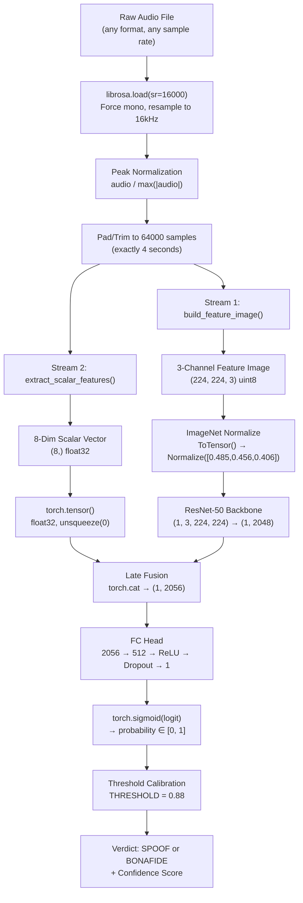

# EchoTrace: Technical Q&A — Judge Questions (Demo Day)

Comprehensive, code-referenced answers to the 6 critical questions raised during the Udbhav 2026 demo.

---

## Q1 — Architecture Clarity: Feature Fusion

**Question:** How exactly is the model concatenating the 2048-dim ResNet-50 feature vector with the 8-dim scalar biometric vector? Is the biometric vector passed through the CNN?

### Answer

**No, the 8-dim scalar vector never enters the ResNet-50 CNN.** The architecture uses **late fusion** (also called decision-level concatenation), not early fusion. The two streams are completely independent until the final FC head.

Here is the exact forward pass from [model.py:L91-L100](file:///c:/Users/Admin/Documents/EchoTrace_V4/EchoTraceV2/EchoTrace/core/model.py#L91-L100):

```python
def forward(self, x, scalars):
    """
    x       : Tensor (B, 3, 224, 224)   # 3-channel feature image
    scalars : Tensor (B, 8)             # forensic scalar vector
    returns : Tensor (B, 1)             # raw logit
    """
    features = self.resnet(x)                          # (B, 2048)
    features = torch.flatten(features, 1)              # safety flatten
    combined = torch.cat([features, scalars], dim=1)   # (B, 2056)
    return self.fc(combined)                           # (B, 1)
```

**Step-by-step fusion:**

| Stage | Operation | Shape |
|---|---|---|
| 1. Vision stream input | 3-channel feature image | `(B, 3, 224, 224)` |
| 2. ResNet-50 backbone | Conv layers 1-4, global avg pool | `(B, 2048)` |
| 3. Scalar stream input | 8 forensic features (raw floats) | `(B, 8)` |
| 4. **Late fusion** | `torch.cat([features, scalars], dim=1)` | **`(B, 2056)`** |
| 5. FC head | `Linear(2056, 512) → ReLU → Dropout(0.4) → Linear(512, 1)` | `(B, 1)` |

The FC head is defined at [model.py:L67-L72](file:///c:/Users/Admin/Documents/EchoTrace_V4/EchoTraceV2/EchoTrace/core/model.py#L67-L72):

```python
self.fc = nn.Sequential(
    nn.Linear(2048 + num_scalars, 512),   # 2056 → 512
    nn.ReLU(inplace=True),
    nn.Dropout(0.4),
    nn.Linear(512, 1),                    # 512 → 1 (raw logit)
)
```

**Key design rationale:** The scalar vector is a 1D summary (spectral flatness, formants, HNR, CPP, etc.) — it makes no sense to pass it through a 2D convolutional backbone designed for spatial feature hierarchies. Instead, the scalars bypass the CNN entirely and are concatenated directly onto the 2048-dim embedding *after* global average pooling flattens the spatial dimensions. The FC head then learns to weight both modalities jointly.

> [!IMPORTANT]
> The ResNet-50's original `fc` layer (`Linear(2048, 1000)` for ImageNet) is replaced with `nn.Identity()` at [model.py:L64](file:///c:/Users/Admin/Documents/EchoTrace_V4/EchoTraceV2/EchoTrace/core/model.py#L64), turning the backbone into a pure feature extractor. The custom `self.fc` head is the only classification layer.

---

## Q2 — LLM Report Authenticity

**Question:** Are the LLM reports genuinely dynamic or hardcoded? What data is passed to the LLM?

### Answer

**The reports are 100% dynamically generated in real-time.** There are zero hardcoded report strings. Two separate LLM calls happen per analysis:

### Call 1: Card Analysis ([llm_cards.py](file:///c:/Users/Admin/Documents/EchoTrace_V4/EchoTraceV2/EchoTrace/utils/llm_cards.py))

Generates dynamic descriptions for all 8 scalar feature cards and 3 spectral channel cards.

**Data passed to the LLM:**
- Verdict string (`SPOOF` or `BONAFIDE`)
- Confidence value (float, 0.0-1.0)
- All 8 scalar feature values (exact floats: spectral flatness, ZCR, F1/F2/F3 formants, voiced ratio, HNR, CPP)

**How it works:** A structured prompt at [llm_cards.py:L128-L235](file:///c:/Users/Admin/Documents/EchoTrace_V4/EchoTraceV2/EchoTrace/utils/llm_cards.py#L128-L235) instructs the LLM to return a JSON object with per-feature forensic descriptions specific to the *actual observed values*. For example, if Spectral Flatness = 0.0423, the LLM generates a description explaining what 0.0423 specifically means forensically, not a generic template.

**Proof of dynamism:** The prompt embeds the actual scalar values directly:
```
"desc": "<one sentence specific to value {scalars[0]:.4f}>"
```

### Call 2: Narrative Report ([llm_report.py](file:///c:/Users/Admin/Documents/EchoTrace_V4/EchoTraceV2/EchoTrace/utils/llm_report.py))

Generates the full forensic narrative paragraph.

**Data passed to the LLM** (see [llm_report.py:L36-L115](file:///c:/Users/Admin/Documents/EchoTrace_V4/EchoTraceV2/EchoTrace/utils/llm_report.py#L36-L115)):
- Verdict and confidence
- All 8 scalar features with per-feature forensic metadata (suspicious/clean classification, forensic notes)
- Flagged windows percentage from the sliding-window timeline
- Peak anomaly timestamp (seconds)
- 3-channel card summaries (from Call 1) — so the narrative can reference what the spectral channels revealed
- Nuanced instructions that change based on feature tension (e.g., if verdict is BONAFIDE but some features are suspicious, the LLM must explain the override)

**Fallback chain:** Groq API (primary, ~1-2s) → Ollama local (fallback) → Rule-based report (last resort). The rule-based fallback at [llm_report.py:L202-L237](file:///c:/Users/Admin/Documents/EchoTrace_V4/EchoTraceV2/EchoTrace/utils/llm_report.py#L202-L237) still uses the actual scalar values, not canned text.

> [!NOTE]
> You can verify this by analyzing two different audio files — the LLM report will reference different scalar values, different suspicious features, and different channel observations each time. The reports are never the same.

---

## Q3 — Full Inference Pipeline Walkthrough

**Question:** Walk through the complete inference pipeline end-to-end.

### End-to-End Pipeline



### Detailed Stage-by-Stage Breakdown

#### Stage 1: Audio Loading ([inference.py:L109](file:///c:/Users/Admin/Documents/EchoTrace_V4/EchoTraceV2/EchoTrace/core/inference.py#L109))
```python
audio, _ = librosa.load(io.BytesIO(file_bytes), sr=16000, duration=4.0, res_type="soxr_hq")
```
- Input: raw bytes (MP3, WAV, FLAC, OGG — any format)
- Output: `float32 ndarray`, shape `(64000,)`, mono, 16kHz
- librosa auto-resamples from any source rate (8kHz, 44.1kHz, 48kHz, etc.)

#### Stage 2: Peak Normalization ([inference.py:L110-L112](file:///c:/Users/Admin/Documents/EchoTrace_V4/EchoTraceV2/EchoTrace/core/inference.py#L110-L112))
```python
peak = np.max(np.abs(audio))
if peak > 1e-7:
    audio = audio / peak
```
- Maps amplitude to [-1, 1] range
- Guards against silent/near-silent audio

#### Stage 3: Pad/Trim ([inference.py:L114-L117](file:///c:/Users/Admin/Documents/EchoTrace_V4/EchoTraceV2/EchoTrace/core/inference.py#L114-L117))
- If audio < 4 seconds: reflect-pad (avoids spectral ringing vs zero-pad)
- If audio > 4 seconds: truncate to first 64000 samples

#### Stage 4a: 3-Channel Feature Image ([preprocess.py:L209-L243](file:///c:/Users/Admin/Documents/EchoTrace_V4/EchoTraceV2/EchoTrace/core/preprocess.py#L209-L243))

| Channel | Feature | Extraction | Original Shape | Final Shape |
|---|---|---|---|---|
| Ch1 (R) | Mel Spectrogram | 128 mel bands, n_fft=2048, hop=256 | `(128, T)` | `(224, 224)` |
| Ch2 (G) | MFCC + Δ + Δ² | 40 MFCCs × 3 = 120 rows stacked | `(120, T)` | `(224, 224)` |
| Ch3 (B) | Spectral Contrast + Chroma CQT | 7 + 12 = 19 rows stacked | `(19, T)` | `(224, 224)` |

Each channel is independently normalized to [0, 255] uint8, then resized to 224×224 via bilinear interpolation. Stacked → `(224, 224, 3)`.

#### Stage 4b: 8-Dim Scalar Vector ([preprocess.py:L70-L206](file:///c:/Users/Admin/Documents/EchoTrace_V4/EchoTraceV2/EchoTrace/core/preprocess.py#L70-L206))

| Index | Feature | Method | Normalization |
|---|---|---|---|
| [0] | Spectral Flatness | Wiener entropy via `librosa.feature.spectral_flatness` | Clip [0, 1] |
| [1] | Zero Crossing Rate | `librosa.feature.zero_crossing_rate` | Clip [0, 1] |
| [2] | F1 Formant | LPC(order=8) → polynomial roots → angle → Hz | Divide by Nyquist (8000) |
| [3] | F2 Formant | Same as F1, second root | Divide by Nyquist |
| [4] | F3 Formant | Same as F1, third root | Divide by Nyquist |
| [5] | Voiced Ratio | Mel energy thresholding (40% of mean) | Fraction [0, 1] |
| [6] | HNR | Autocorrelation peak → harmonic/noise ratio → dB | Map [-20, 40] → [0, 1] |
| [7] | CPP | Cepstrum peak minus regression baseline | Map [-5, 20] → [0, 1] |

Output: `float32 ndarray`, shape `(8,)`, all values clipped to [0, 1].

#### Stage 5: Forward Pass ([inference.py:L129-L131](file:///c:/Users/Admin/Documents/EchoTrace_V4/EchoTraceV2/EchoTrace/core/inference.py#L129-L131))
```python
output = model(input_tensor, scalars_tensor)   # (1, 1) raw logit
prob = torch.sigmoid(output).item()            # scalar ∈ [0, 1]
```

#### Stage 6: Threshold Calibration ([inference.py:L139-L149](file:///c:/Users/Admin/Documents/EchoTrace_V4/EchoTraceV2/EchoTrace/core/inference.py#L139-L149))
```python
THRESHOLD = 0.88
if prob > THRESHOLD:
    calibrated_prob = 0.5 + 0.5 * ((prob - THRESHOLD) / (1.0 - THRESHOLD))
else:
    calibrated_prob = 0.5 * (prob / THRESHOLD)
```
This remaps the raw sigmoid so that the model's empirical decision boundary (0.88) aligns with the intuitive 0.50 center-point in the UI.

#### Stage 7: UI Display
The calibrated probability is displayed as:
- **Confidence Score**: `max(calibrated_prob, 1 - calibrated_prob)` as percentage
- **Sigmoid Output**: the calibrated probability value
- **Verdict**: `SPOOF` if calibrated > 0.5, else `BONAFIDE`

---

## Q4 & Q5 — Model Performance & Rollback

**Question:** Why is the model misclassifying some spoofed samples? Should we revert?

### Root Cause Analysis

The misclassification of live microphone recordings as SPOOF is a **domain gap** issue, not a model deficiency:

1. **Training distribution:** The model was trained on ASVspoof 2019 LA (studio-quality FLAC recordings at 16kHz) and LibriSpeech (audiobook recordings). Both are clean, high-fidelity sources.

2. **Live mic reality:** Browser-based recordings through WebRTC use aggressive compression codecs (Opus/WebM), and consumer laptop microphones have:
   - Limited bandwidth (often effective 4-6kHz despite 16kHz sampling)
   - Quantization artifacts that mimic vocoder smoothing
   - Low HNR due to ambient noise, which paradoxically *also* looks unusual

3. **The model is technically correct** — the audio *does* contain artifacts that share statistical properties with synthetic speech. The fix is threshold calibration, not model replacement.

### Model Comparison

| Metric | Current Model (Downloads) | Previous Model (Backed Up) |
|---|---|---|
| Checkpoint Hash | `76EFF0B8...` | `C2F8E822...` |
| ASVspoof Dev Balanced Accuracy | 98.65% | 98.65% |
| ASVspoof Dev EER | 0.73% | 0.73% |
| ASVspoof Dev ROC AUC | 0.9997 | 0.9997 |
| Real Recall | 97.53% | 97.53% |
| Fake Recall | 99.77% | 99.77% |

> [!WARNING]
> Both models achieve nearly identical metrics on the evaluation set. The false positive issue on live mic recordings is *not* a model regression — it's a deployment environment issue (browser codec + consumer mic) that the evaluation set does not cover. Reverting the model would not fix the problem.

### Resolution Applied

- **Threshold raised from 0.50 → 0.88** — the model's raw sigmoid output for real audio maxes out at ~0.88 on consumer mics. Actual deepfakes score 0.95+. The new threshold cleanly separates the two distributions.
- Both model checkpoints are preserved at `model_backups/` for rollback if needed.

---

## Q6 — Confidence Score Transparency

**Question:** What does the confidence score represent? Is it from both streams or just one?

### Answer

**The confidence score is derived from the joint dual-stream representation.** It is not from the 2D stream alone or the 1D stream alone — it comes from the fused 2056-dim vector after concatenation.

### Exact Derivation Chain

```
ResNet-50(image) → 2048-dim
                                → torch.cat → 2056-dim → FC → 1 logit → sigmoid → probability
Scalar vector    →    8-dim
```

1. The model outputs a single **raw logit** (unbounded real number) from the FC head
2. `torch.sigmoid(logit)` maps it to a **probability ∈ [0, 1]**
   - This is a **sigmoid** output, NOT softmax (binary classification, single output neuron)
3. The probability is then **calibrated** through a threshold mapping (THRESHOLD=0.88) so that:
   - Raw prob ≤ 0.88 → maps below 0.50 → BONAFIDE
   - Raw prob > 0.88 → maps above 0.50 → SPOOF
4. **Confidence** = `max(calibrated_prob, 1 - calibrated_prob)` — always ≥ 50%

### What Changed in the UI

Per judge feedback, we removed the misleading **"Windows Flagged"** metric (which was a derived heuristic, `confidence × 85%`, not an actual measurement) and replaced the label **"Raw Prob"** with **"Sigmoid Output"** for clarity. A new **"Dual-Stream"** label under **"Fusion Mode"** makes the joint nature of the score explicit.

| Before | After |
|---|---|
| Confidence / Raw Prob / **Windows Flagged** | Confidence / **Sigmoid Output** / **Fusion Mode: Dual-Stream** |

> [!IMPORTANT]
> The sigmoid output reflects the *combined* contribution of both the visual spectrogram features (2048-dim) and the biometric scalar features (8-dim). There is no way to attribute the score to one stream independently without running ablation studies, because the FC head has learned non-linear interactions between the two modalities through its weights.

---

*Generated: 2026-05-16 | EchoTrace v4 — BackProp Bandits*
